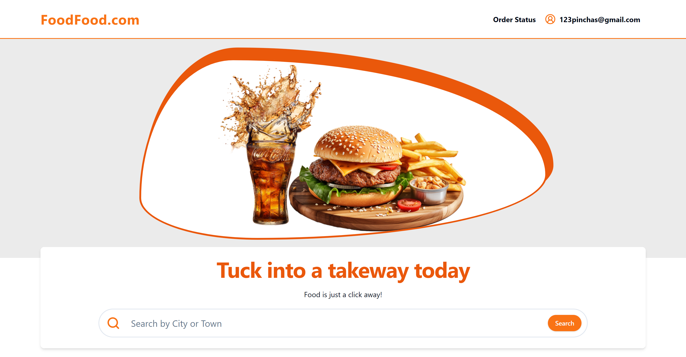

# Enterprise-Level Food Ordering Platform

## Overview

This project showcases the development of a comprehensive food ordering platform using modern web technologies. The application includes features such as user registration, restaurant search, cart management, and real-time order status updates. The project is built using React, Node.js, MongoDB, and Stripe, demonstrating a full-stack approach to creating an enterprise-level application.

- [View the live site](https://foodfood.onrender.com/) 🚀

## Key Features

- **User Registration & Authentication**: Secure user registration and login functionality.
- **Restaurant Search**: Advanced search capabilities to find restaurants based on user preferences.
- **Cart Management**: Add and manage items in the cart with real-time updates.
- **Order Status**: Real-time order status updates to keep users informed.
- **Stripe Integration**: Seamless payment processing using Stripe.
- **Responsive Design**: Tailwind CSS and ShadCN library for a responsive and user-friendly interface.
- **Real-Time Updates**: Using React hooks and polling for dynamic content updates.
- **Error Handling**: Robust error handling and validation throughout the application.

## Technologies Used

- **Frontend**:

  - React.js
  - Tailwind CSS
  - ShadCN library
  - React Router DOM
  - React Hook Form
  - TypeScript

- **Backend**:

  - Node.js
  - Express.js
  - MongoDB
  - Stripe API
  - Auth0 for authentication
  - Cloudinary for image uploads

- **Development Tools**:
  - Git & GitHub
  - Stripe CLI for webhooks
  - Render.com for deployment
  - React Query for data fetching

## Setup & Installation

### Prerequisites

- Node.js (>= 20.10)
- MongoDB
- Stripe account for payment processing
- Auth0 account for authentication

---

1. Clone the repository:

```bash
   git clone https://github.com/Pinchas-G/mern-food-ordering-app-frontend.git
   git clone https://github.com/Pinchas-G/mern-food-ordering-app-backend.git
```

2. Create a .env file in the `backend` directory and add your environment variables:

```bash
SERVER_PORT=
```

MongoDB

```bash
MONGODB_CONNECTION_STRING=
```

Auth0

```bash
AUTH0_AUDIENCE=
AUTH0_ISSUER_BASE_URL=
```

Cloudinary

```bash
CLOUDINARY_CLOUD_NAME=
CLOUDINARY_API_KEY=
CLOUDINARY_API_SECRET=
```

Stripe

```bash
FRONTEND_URL=
STRIPE_API_KEY=
STRIPE_WEBHOOK_SECRET=
```

3. Create a .env file in the `frontend` directory and add your environment variables:

```bash
   VITE_API_BASE_URL=
   VITE_AUTH0_DOMAIN=
   VITE_AUTH0_CLIENT_ID=
   VITE_AUTH0_CALLBACK_URL=
   VITE_AUTH0_AUDIENCE=
```

4. Navigate to the `backend` directory

```bash
   cd mern-food-ordering-app-backend
   npm install
   npm run dev
```

5. Navigate to the `frontend` directory

```bash
   cd mern-food-ordering-app-frontend
   npm install
   npm run dev
```

## License

This project is licensed under the MIT License - see the [LICENSE](https://github.com/git/git-scm.com/blob/main/MIT-LICENSE.txt) file for details.

## Acknowledgements

- [Stripe](https://stripe.com) for payment processing
- [Cloudinary](https://cloudinary.com) for image management
- [Auth0](https://auth0.com/) for authentication
- [React](https://reactjs.org) for building the user interface
- [Node.js](https://nodejs.org) for server-side logic
- [MongoDB](https://www.mongodb.com) for database management

## Contact

For any questions or suggestions, please reach out to [email](mailto:123pinchas@gmail.com).

## Screenshots

### Home Page
  

### Search Results Page  
  

### Manage Restaurant Page
  

### Order Status Page
  
